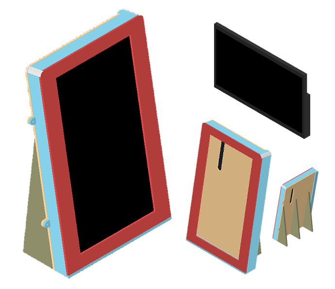
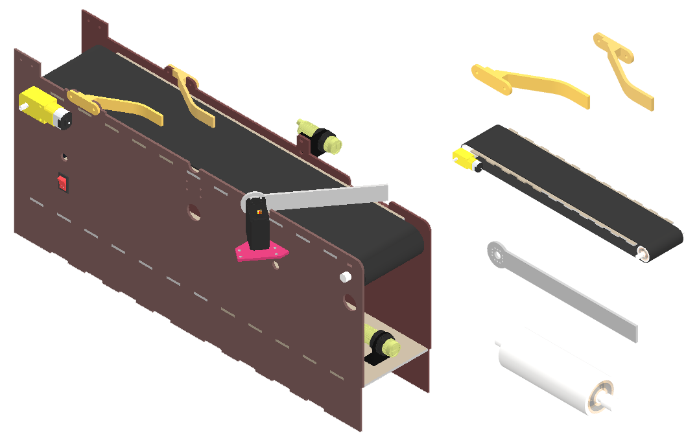
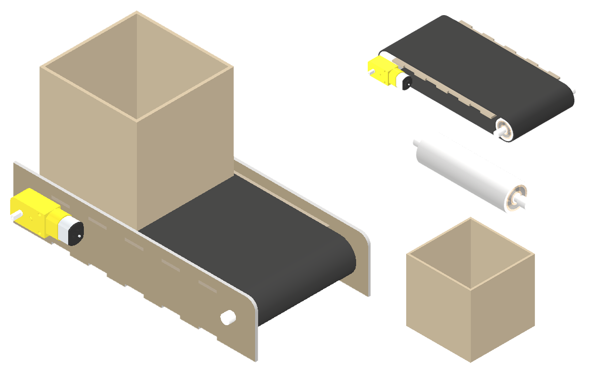
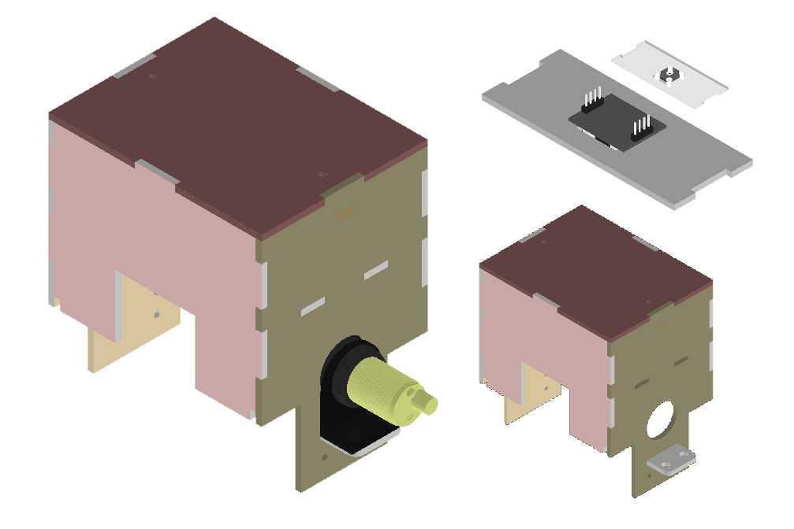

# Introducción
En el presente repositorio se encuentra una recopilación de mis diferentes diseños 3D de los projectos en los que he participado a lo largo de mi trayectoria académica y profesional. Estos diseños muestran mis habilidades en modelado 3D, diseño mecánico y desarrollo de productos utilizando principalmente el software Autodesk Inventor.

# Caja de acceso
Se solicitó crear una caja de acceso de dimensiones reducidas que pueda exponer en su frente un teclado matricial de tipo membrana y un display LCD. Como requerimientos del diseño de solicitó que se deje espacio para el PCB del dispositivo y un buzzer pequeño y que se deje huecos en la cara trasera para el pase de cableado. Además, se solicitó que se agreguen huecos en la parte inferior para la emisión de sonido y para la ubicación de un botón de reinicio del sistema. Para la cara frontal se modificaron diseños 3D de monturas para el teclado matricial de tal manera que también encaje el display LCD en este. Para el acceso al PCB para su mantenimiento se integraron aletas con huecos para pernos como método de fijación de una tapa trasera. El diseño presentado fue realizado teniendo en consideración la intención del cliente de hacer uso de acrílico procesado mediante corte laser como material principal para su fabricación.

# Soporte para monitor
Se diseñó un soporte de sobremesa compacto para un monitor SAMSUNG S19A330NHL de 18 pulgadas. Para esto se tomaron las medidas del monitor y se realizó su diseño 3D para luego poder diseñar un soporte con inclinación de 10 grados, facilidad de ensamblaje y que no impida la conexión de los cables del monitor. Para el acceso al monitor para su retiro o mantenimiento se integraron aletas con huecos para pernos como método de fijación de una tapa trasera de inserción lateral.

# Robot de triaje
Como parte de un proyecto académico se decidió realizar un robot para triaje. A solicitud de los profesores se tuvo como requerimiento que este diseño tenga una forma antropomorfica, es por esto que se decidió tener un torso más curvo con un diseño inspirado por el robot Qhali y se optó por utilizar modelos ya existentes de manos "low-poly" modificados con espacio para pasar cables

# Planta empacadora de bloques
Como parte de un proyecto colaborativo con la Universidad Nacional Autónoma de México (UNAM) se realizó la creación de una planta empacadora de bloques de colores en miniatura. El presente modelo fue diseñado teniendo en mente su fabricación mediante el uso de MDF 3mm y equipos de corte láser.

Para la realización de este proyecto se escogió utilizar una metología de diseño modular, dividiendo la planta en diferentes módulos montables: 
- Rack de actuadores
- Faja transportadora 1
- Faja transportadora 2
- Torre de sensado

### Rack de actuadores
El primer módulo diseñado fue un rack vertical por el cual caerían y se acumularían productos destinados a ser empujados hacia una faja transportadora mediante el uso de actuadores lineales. Para lograr esto, se requirió diseñar una estructura montable que permita contener y guiar a los productos en su caída y ubicarlos en una posición específica consistentemente tal que los actuadores puedan empujarlos sin impedir la caída de los siguientes productos. Además, se tuvo que diseñar una caja de actuadores, para la cual se tuvo que adaptar diseños ya existentes de actuadores lineales para que puedan satisfacer los requerimientos de tamaño y distancia de actuación del rack y puedan ser fijados a la estructura. Para el acceso a los actuadores para su mantenimiento se integraron aletas con huecos para pernos como método de fijación de una tapa trasera.

### Faja transportadora 1
Luego, se diseñó la estructura de una faja transportadora que permita desplazar los productos haciendolos pasar por una estación de sensado de color, sensores de proximidad infrarrojos y servomotores con de guías para el reposicionamiento de productos. Para el funcionamiento de la faja se fabricaron mediante impresión 3D rodillos dentro de los cuales se fijaron rodamientos en sus extremos, y dentro de estos se fijaron otras piezas que permitirían fijar los rodillos a la estructura y establecer un enlace con el eje giratorio del motor encargado del movimiento de la faja. Se decidió aprovechar la altura de esta faja para utilizar el espacio interno para almacenamiento de los cables y controladores de la planta, por lo que se agregaron huecos en diferentes puntos de la estructura para pasar cables. Además,para asegurar el centrado de las piezas en la faja para su entrada a la torre de sensado y el guiado de los productos en caso sean rechazados por la planta se diseñaron guías de dirección colocadas en ambos lados de la estructura y una guía de rechazo con huecos para su enlace con el eje rotatorio del servomotor de rechazo.

### Faja transportadora 2
Seguidamente, se diseñó una estructura de similar funcionamiento a la faja transportadora 1, solo cambiando su ancho para poder transportar una caja que estará recibiendo los productos que caida desde la faja transportadora 1.

### Torre de sensado
Para el sensado de colores de lo productos se decidió diseñar una torre de sensado que permita cubrir el producto y mantener en oscuridad el sensor de colores para minimizar la interferencia en las mediciones ocasionada por la variación de la intensidad de luz exterior. Se fijó el sensor de colores a una distancia de 5mm con respecto al producto a medir para reducir el error del sensado debido a la distancia. Para el acceso a al sensor para su mantenimiento se integraron aletas con huecos para pernos como método de fijación de una tapa superior.

