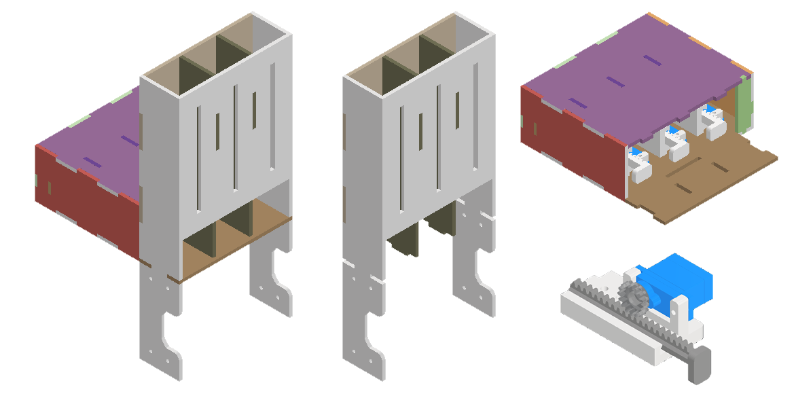

# Introducción
En el presente repositorio se encuentra una recopilación de mis diferentes diseños 3D de los projectos en los que he participado a lo largo de mi trayectoria académica y profesional. Estos diseños muestran mis habilidades en modelado 3D, diseño mecánico y desarrollo de productos utilizando principalmente el software Autodesk Inventor.

# Planta de empacadora de bloques
Como parte de un proyecto colaborativo con la Universidad Nacional Autónoma de México (UNAM) se realizó la creación de una planta empacadora de bloques de colores en miniatura. El presente modelo fue diseñado teniendo en mente su fabricación mediante el uso de MDF 3mm y equipos de corte láser.

Para la realización de este proyecto se escogió utilizar una metología de diseño modular, dividiendo la planta en diferentes módulos montables: 
- Rack de actuadores
- Faja transportadora 1
- Faja transportadora 2
- Torre de sensado

## Rack de actuadores
El primer módulo diseñado fue un rack vertical por el cual caerían y se acumularían productos destinados a ser empujados hacia una faja transportadora mediante el uso de actuadores lineales.

Para lograr esto, se requirió diseñar una estructura montable que permita contener y guiar a los productos en su caída y ubicarlos en una posición específica consistentemente tal que los actuadores puedan empujarlos sin impedir la caída de los siguientes productos.

Además, se tuvo que diseñar una caja de actuadores, para la cual se tuvo que adaptar diseños ya existentes de actuadores lineales para que puedan satisfacer los requerimientos de tamaño y distancia de actuación del rack y puedan ser fijados a la estructura.

