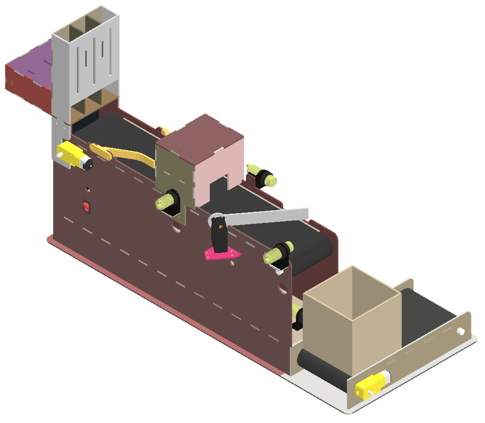

# Introducción
En el presente repositorio se encuentra una recopilación de mis diferentes diseños 3D de los projectos en los que he participado a lo largo de mi trayectoria académica y profesional. Estos diseños muestran mis habilidades en modelado 3D, diseño mecánico y desarrollo de productos utilizando principalmente el software Autodesk Inventor.

# Planta de empacadora de bloques
Como parte de un proyecto colaborativo con la Universidad Nacional Autónoma de México (UNAM) se realizó la creación de una planta empacadora de bloques de colores en miniatura. El presente modelo fue diseñado teniendo en mente su fabricación mediante el uso de MDF 3mm y equipos de corte láser.

